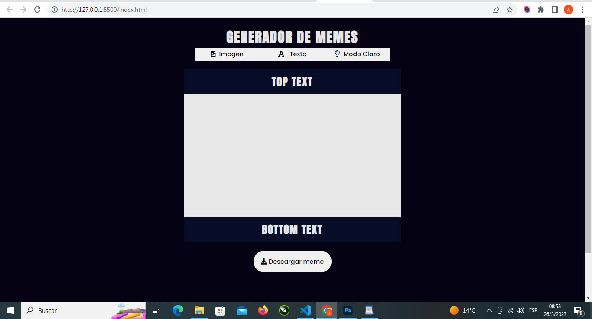
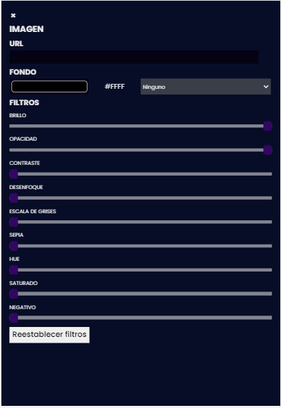
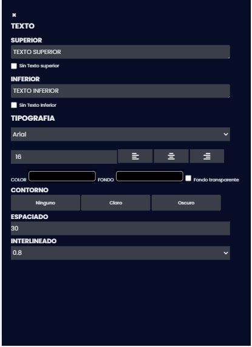
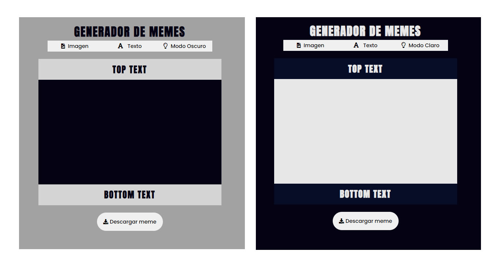
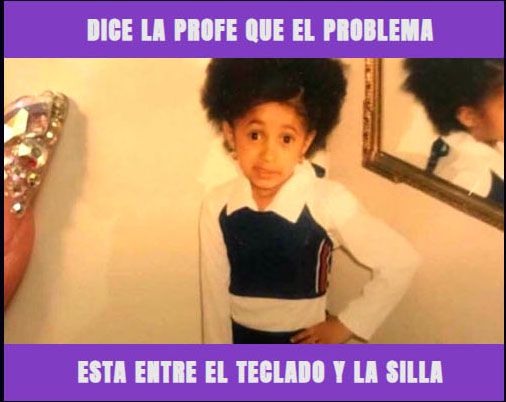

# Gestor de Memes - Proyecto JS para Carrera Desarrollo Frontend ADA
<p> Es una aplicación realizada para el módulo II (JavaScript) de la Carrera de Desarrollo Fronted en ADA. Es parte de un proceso de aprendizaje. </p>

[link del proyecto](https://ana-laura-flores.github.io/gestor-de-memes/)

## Un poco de la trastienda del proyecto

 - Se utiliza lenguaje HTML, CSS y JavaScript

``` html
 <section class="main__meme">
    <div class="meme__text top" id="div__top">
         <h2 id="h2__top">TEXTO SUPERIOR</h2>
    </div>
    <div class="meme__image" id="image__meme"></div>
    <div class="meme__text bottom"id="div__bottom">
        <h2 id="h2__bottom" >TEXTO INFERIOR</h2>
    </div>
 </section>

 ```     
 fragmento de código      


 - En el desarrollo del proyecto para su funcionamiento se utiliza JavaScript para modificar dinámicamente su contenido y sus propiedades tanto del texto como de la imagen. Utilizando funciones, variables, eventos.

 ``` javascript
 const meme =()=>{
$("#url__image").addEventListener("input", ()=>{
    const urlImage = $("#url__image").value
    $(".meme__image").style.backgroundImage = `url(${urlImage})`
    $(".meme__image").style.backgroundSize ="cover"
    $(".meme__image").style.backgroundPosition ="center"
    })
}
meme()
```
ejemplo de una función realizada en el proyecto
 
 <br>


## Es una aplicación con la que podrás manipular el texto y la imagen para crear tu propio meme.
<br>



<p>Podrás poner una imagen a tu elección en el panel de imagen en la url y luego modificar su <em>color, contraste, opacidad y muchas más variables.</em></p> 
<br>


<br>

<p>Podrás agregarle un texto superior y otro inferior o también podrás elegir que sólo tenga uno de los dos. Todas estas opciones y más las manejas desde el panel de texto. Pudiendo cambiar la <em>tipografía, tamaño, color, alineación, fondo, contorno, espaciado.</em></p>
<br>



<br>
<p> En este proyecto también podrás cambiar el modo de verlo MODO CLARO - MODO OSCURO</p>
<p> <em> Esta parte del proyecto también se realiza con JavaScript </p>




### Una vez que lográs el meme que querés podrás descargarlo para compartirlo con quien vos quieras.
<br>



## Espero disfrutes utilizandolo como yo disfruté creandolo!


<br>
<p style="font-family:Arial; font-size:24px;"> Ana Laura Flores </p>
 <p style="font-family:Arial; font-size:12px; color:#d813be"> (DISEÑADORA GRÁFICA UBA - ESTUDIANTE FRONTEND) </p>


